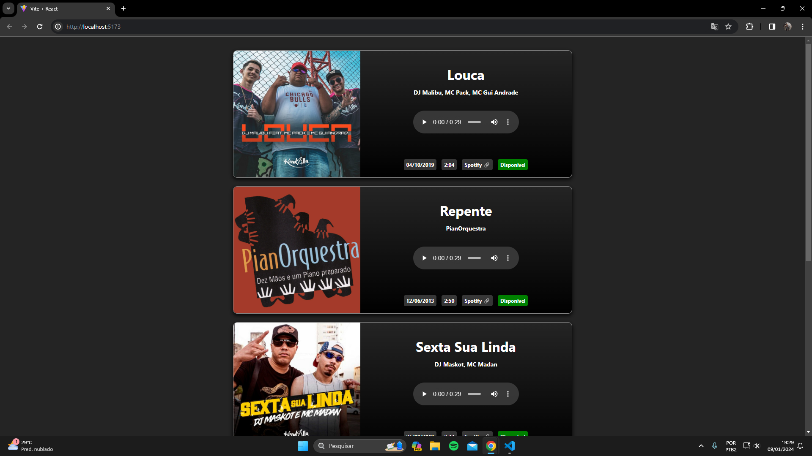
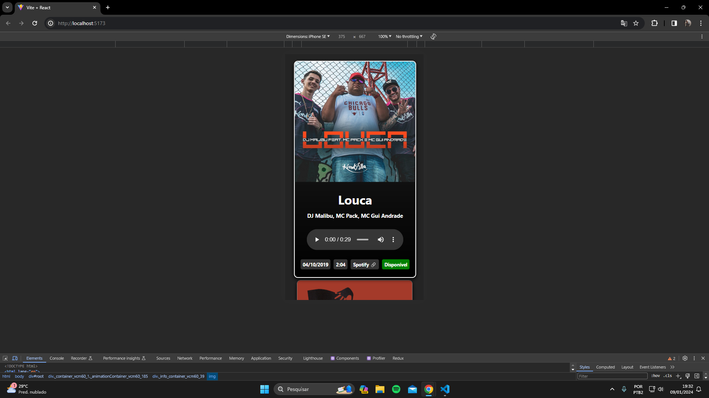

# Maiores dificuldades inicialmente

- Descobrir como setar os parametros que tinham que ser passados pra conseguir fazer as requisições das músicas. Demorei bastante tempo lendo a documentação da API do Spotify e pesquisando como consumir da maneira certa.

- Implementar todo o fluxo de erro.

- Implementar a responsividade do layout para padrão mobile.

# Informações principais

- Escolhi usar React no lugar de Angular, porque é a tecnologia que domino.
- Optei por usar Custom Hooks e manter a lógica dos componentes o mais simples/limpa possível.
- Não existe um grande motivo pra escolha de como eu estruturei o projeto, apenas segui muita das coisas que aprendi em meu primeiro estágio como desenvolvedor Web.
- Mantive comentários ao longo do código para facilitar quem está lendo e também me lembrar.

# Pontos de melhoria

- Refatorar todo o fluxo de erro, melhorando a lógica e centralizando as informações fora do useMusicData.
- Usar um player com estilo próprio pra trazer mais harmonia ao design.

# Funcionamento da estrutura

## Consts

- Contém 3 informações essenciais pro funcionamento do desafio, como, lista de ISRCs, Client ID e Secret Client ID.

## Hooks

### useMusicData

Responsável por consumir o arquivo de constantes utilizando os Client IDs para construção da chamada para API que retorna a chave necessária para consumir de fato API do Spotify atráves do service "music.service.js".

### useSongHighlight

- Trata os dados gerados para serem consumidos na interface dos site, tais quais, data, disponibilidade da faixa, tempo em minutos/segundos, link pra música, entre outras coisas.

## Service

### music.service.js

- Faz a requisição pra API do Spotify e busca todas as músicas da lista de ISRC em paralelo, retornando o objeto com as informações da música ou "null" em caso de não encontrar aquela ISRC. Após esse procedimento é feito um build dos dados, retornando apenas as informações que serão usadas no front e ordendando pela ordem alfabetica.

## Componentes: errorModal, Player, SongHighlight

### errorModal

- Em caso de qualquer erro que tenha sido tratado a modal exibe um feedback pro usuário de qual erro ocorreu e um botão para que usuário possa dar reload na página.

### Player

- Responsável por reproduzir um preview da música.

### SongHighlight

- Exibe todas as informações da faixa de acordo com o que foi pedido no desafio.

# Imagens

